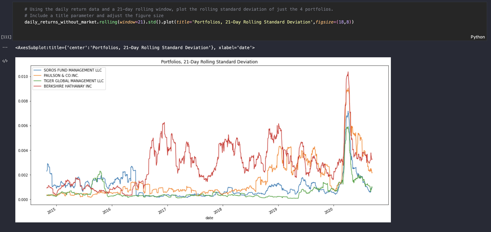

# *Risk/Return Analysis*
---

**Welcome to my repository for the project on Risk/Return analysis. Please explore the codebase!** <br />

>“Money, if it does not bring you happiness, will at least help you be miserable in comfort.” – Helen Gurley Brown
---



---

## Technologies

This project leverages python 3.7 with the following packages:

* [pandas](https://pandas.pydata.org) - Library for fast manipulation with DataFrames, reading and writing csv files.

* [pathlib](https://github.com/python/cpython/blob/3.10/Lib/pathlib.py) -  Instantiates a concrete path for the platform the code is running on.

* [matplotlib](https://matplotlib.org) - Library for visualizations in Python.
---

## Installation Guide

Before running the application first install the following dependencies.

```python
  pip install pandas
  pip install pathlib
  pip install matplotlib
```

---

## Usage

To use the crypto project simply clone the repository and run the code **risk_return_analysis.ipynb** in jupyter lab or in VS Code.

---

## Contributors

Brought to you by Katerina Gawthorpe.

---

## License

MIT